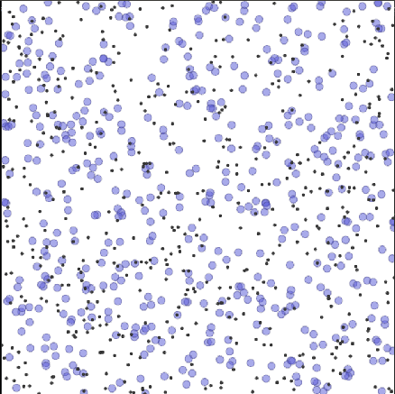
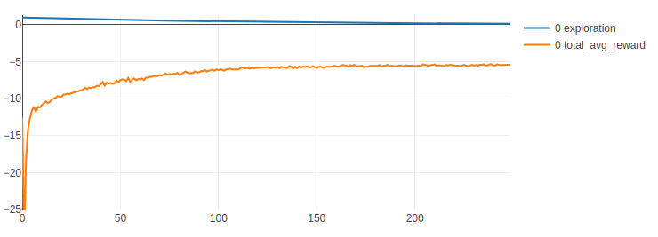

# Scalable reinforcement learning from local observations

## Goal
These are preliminary experiments towards a Badger-like architecture trained using the Multi-Agent Reinforcement Learning (MARL) paradigm.

The main property evaluated in this experiment is scalability: it should be possible to train experts on small example of the problem, then scale it up just by increasing the complexity of the task and adding more experts (without needing to retrain the policy).

## Task description

The scalability property is achieved via the sharing of expert policies, here each expert gets a local observation. 

We examine this using the experiments in our modified version of Multi-Agent Particle Environment ([MPE](https://github.com/openai/multiagent-particle-envs)) and focus on solving the Cooperative Navigation task described in the paper: [Multi-Agent Actor-Critic for Mixed Cooperative-Competitive Environments](
https://arxiv.org/abs/1706.02275).

 

The environment is 2D (top-down) with simulated physics, blue experts can accelerate in two directions (x, y) and can collide against each other.
In the Cooperative Navigation task, there are N experts and N landmarks; the experts should cover the landmarks in a cooperative way while avoiding collisions, the population of experts are collectively judged on how many of the landmarks are covered and the number of collisions that occurred.

Compared to the original paper, our experts perceive positions of M nearest landmarks and M-1 nearest experts in an ego-centric manner and its own velocity. The paper [Learning attentional communication for multi-agent cooperation](https://arxiv.org/abs/1805.07733), which presents the attentional-communication model ATOC, uses these same local observation on the same task.

## Model description

We have implemented the following algorithms: Deep Deterministic Policy Gradients (DDPG) presented in [Continuous control with deep reinforcement learning](https://arxiv.org/pdf/1509.02971.pdf) and the [ATOC](https://arxiv.org/abs/1805.07733), although we are primarily interested in the locality properties, and are not focusing on communication yet. All policies are feedforward networks with 4 hidden layers with LeakyReLU activations and Tanh on the output.

We compare the performance of:

* Independent DDPG policies (each expert is controlled by its own DDPG policy)
* Global DDPG policy (all expert are controlled by one DDPG policy)
* ATOC without communication (each expert is controlled by own DDPG, where all experts share the same policy).

Each of the experiments is ran with N=4 (number of experts and landmarks) and N=12.
We empirically show that the benefit of ATOC is that we can train a shared policy on N=4 and then successfully apply that policy to the scenario with N=12 without retraining. And that the performance difference between N=4 and N=12 is negligible.

## Results

Results of training of the ATOC without communication for N=4 and then applying to N=12 environment.
Due to the shared policy and locally-defined observations, the experts can work in the bigger setting still reasonably well. 

This is an example convergence of the ATOC without communication in case of N=4 (better comparison to be added soon).

Rendering of the resulting policy trained on N=4 and then applied to N=12.

ATOC policy without communication trained on N=4   

ATOC policy without communication trained N=4 and evaluated on N=12   

ATOC policy without communication trained on N=4 and evaluated on N=80   

### Reproducing the results

The experiment can be ran from the root directory by `marl/experimental/deeprl/experiments/run_multiagent.py` script which accepts the commandline parameters, or any of the preconfigured scripts `marl/experimental/deeprl/experiments/batch_run_*`, the scripts will store serialized models and average reward statistics under `data/models/` and `data/stats`.

The `run_multiagent.py` script allows you to configure any of the main parameters of the simulation using commandline parameters. A complete configuration for each of the networks (ATOC, DDPG, DDPG_global) can be found in their json files under `marl/experimental/deeprl/experiments/data/json`.

## Discussion and next steps

This experiment validated the promising property of scalable expert policies which are shared across experts and make use of only local observations.

Next, we will consider experiments with communication between experts.

